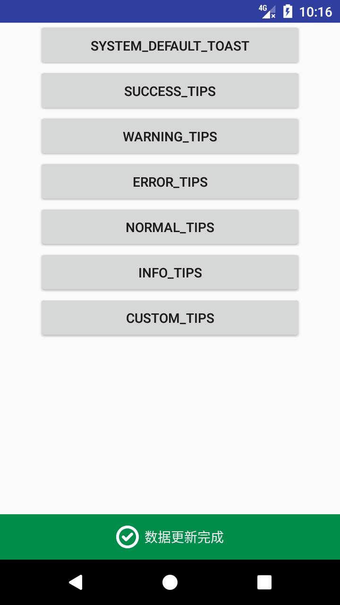
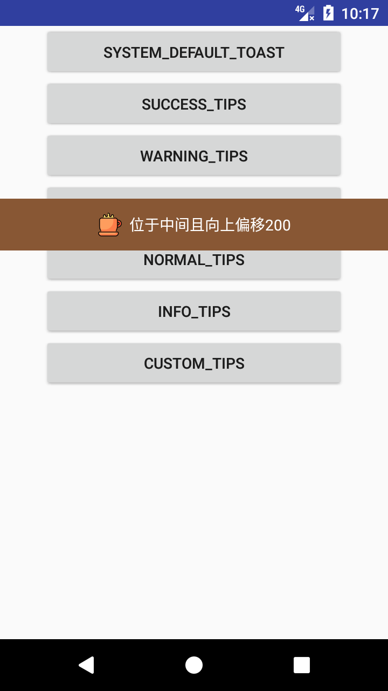
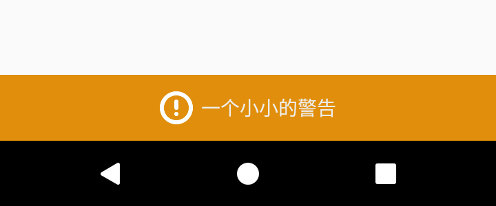
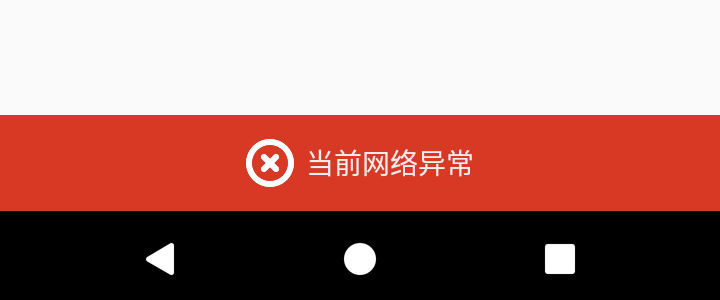
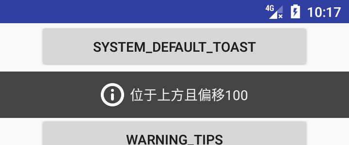
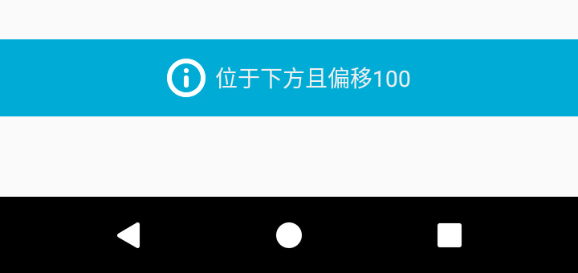

# Toaster

[](https://www.android.com)
[](https://android-arsenal.com/api?level=9)
[](http://www.opensource.org/licenses/mit-license.php)
[](https://jitpack.io/#Wang-Jiang/Tips)

## 什么是Tips

Tips是参考Android的Toast源码开发的，本质作用和Toast类似，用于向用户提示一些信息
但是Tips是单例的，这意味着不会像Toast那样，不断弹出，如果当前屏幕存在一个Tips，其他的显示Tips的代码都不会被执行，也不会等待当前的Tips消失后依次弹出

## 实现原理

这个实际上和Android的Toast已经没有什么关系了，就是在屏幕显示一个view，类似于悬浮窗效果，然后通过handler去延时移除view，达到类似于Toast的提示效果

## Dependency

Add it in your root build.gradle at the end of repositories:

	allprojects {
		repositories {
			...
			maven { url 'https://jitpack.io' }
		}
	}

Add the dependency

	dependencies {
		compile 'com.github.Wang-Jiang:Tips:v0.1'
	}

## 如何使用

这个的使用和我的另外一个库[Toaster](https://github.com/Wang-Jiang/Toaster)相似，Tips的使用方式很简单，内部封装了一些常见的方法便于在不同的场景使用

它内置了`success()`，`error()`，`warning()`，`info()`，`normal()`等方法(基本上和Toaster类似)

显示一条表示成功的Tips
```java
Tips.success(getApplicationContext(), "数据更新完成", Toast.LENGTH_SHORT).show();
```

<div align="center">
	
</div>

显示一条完全自定义的Tips
```java
Tips.makeText(getApplicationContext(), getIcon(R.drawable.ic_coffee_cup), Color.parseColor("#885734"), "位于中间且向上偏移200", Color.parseColor("#FFFFFF"), Tips.LENGTH_LONG, Gravity.CENTER, -200).show();
```

<div align="center">
	
</div>

应当注意到上面的`makeText`存在一个Y轴偏移量，这个实际上就是给`WindowManager.LayoutParams`的`y`变量赋值，当`gravity`是`TOP`的时候，表示向屏幕下方偏移，当为`BOTTOM`的时候，则是向上，如果是`CENTER`，则负数表示向上，正数表示向下偏移

其他效果如下

<div align="center">
	<br>
	<br>
	<br>
	<br>
</div>

## 存在的问题

在Android7.0上，如果当前的屏幕存在一个Toast，执行Tip的show()的时候会抛出异常，这个是由于`mWM.addView(mView, mParams)`导致的，会看到类似于下面的报错信息

    android.view.WindowManager$BadTokenException: Unable to add window -- window android.view.ViewRootImpl$W@ff673eb has already been added
        at android.view.ViewRootImpl.setView(ViewRootImpl.java:691)
        at android.view.WindowManagerGlobal.addView(WindowManagerGlobal.java:342)
        at android.view.WindowManagerImpl.addView(WindowManagerImpl.java:93)
        .......
        at com.android.internal.os.ZygoteInit.main(ZygoteInit.java:776)

在其他的系统上面并没有出现这个问题，实际上你可以尝试将`WindowManager.LayoutParams`的`type`设置为`WindowManager.LayoutParams.TYPE_PHONE`，但是这个需要权限`android.permission.SYSTEM_ALERT_WINDOW`
这个权限在Android高版本限制很大，甚至默认是关闭的，需要用户手动打开，而一些第三方的ROM同样对此权限限制很大，主要是因为这个权限经常被用来一些应用用来做悬浮广告，对用户体验影响很大
为了防止出错，Tips在调用`addView()`增加了`try`，但是这个并没有完全解决问题，当屏幕上存在一个Tips的时候，去调用Toast的`show()`还是会导致应用崩溃

## 注意事项

类似于Toast，不要忘记调用`show()`去显示Tips

## 开源协议

        The MIT License (MIT)

        Copyright (c) 2017 Wang-Jiang

        Permission is hereby granted, free of charge, to any person obtaining a copy
        of this software and associated documentation files (the "Software"), to deal
        in the Software without restriction, including without limitation the rights
        to use, copy, modify, merge, publish, distribute, sublicense, and/or sell
        copies of the Software, and to permit persons to whom the Software is
        furnished to do so, subject to the following conditions:

        The above copyright notice and this permission notice shall be included in all
        copies or substantial portions of the Software.

        THE SOFTWARE IS PROVIDED "AS IS", WITHOUT WARRANTY OF ANY KIND, EXPRESS OR
        IMPLIED, INCLUDING BUT NOT LIMITED TO THE WARRANTIES OF MERCHANTABILITY,
        FITNESS FOR A PARTICULAR PURPOSE AND NONINFRINGEMENT. IN NO EVENT SHALL THE
        AUTHORS OR COPYRIGHT HOLDERS BE LIABLE FOR ANY CLAIM, DAMAGES OR OTHER
        LIABILITY, WHETHER IN AN ACTION OF CONTRACT, TORT OR OTHERWISE, ARISING FROM,
        OUT OF OR IN CONNECTION WITH THE SOFTWARE OR THE USE OR OTHER DEALINGS IN THE
        SOFTWARE.